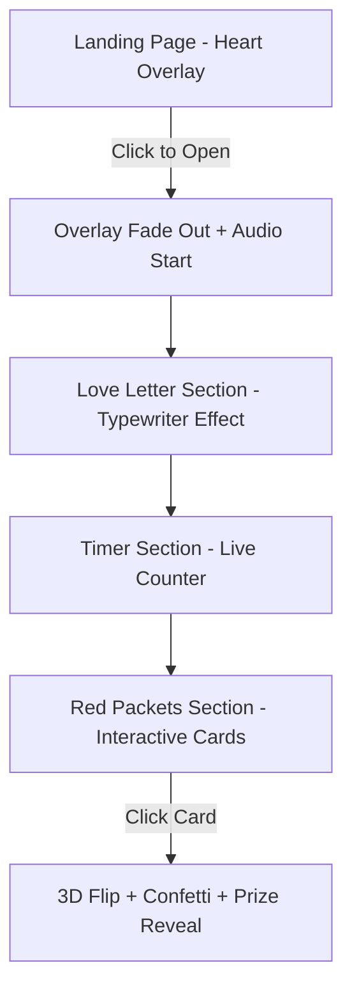

## 1. Product Overview
A mobile-first Valentine's Day website designed to create a romantic and interactive experience for your girlfriend. This static website features rich animations, romantic styling, and interactive elements including a love letter with typewriter effect, relationship timer, and flip card red packets with prizes.

The product solves the need for a personalized, romantic digital experience that combines visual appeal with interactive storytelling, perfect for expressing love on Valentine's Day.

## 2. Core Features

### 2.1 User Roles
This is a single-user experience website with no authentication required.

### 2.2 Feature Module
The Valentine's Day website consists of the following main sections:
1. **Intro Section**: Full-screen overlay with pulsing heart icon and click-to-enter interaction
2. **Love Letter Section**: Typewriter effect displaying a romantic letter in code block/card format
3. **Timer Section**: Real-time counter showing time since relationship start date (2023-01-01)
4. **Red Packets Section**: Three interactive flip cards revealing romantic prizes with confetti effects

### 2.3 Page Details
| Page Name | Module Name | Feature description |
|-----------|-------------|---------------------|
| Main Page | Global Styling | Apply romantic pink & red gradient background across all sections. Use cute, readable font family. |
| Main Page | Audio Control | Play background music (bgm.mp3) only after first user interaction (click). |
| Intro Section | Heart Overlay | Display full-screen overlay with pulsing heart icon from lucide-react. Show "Click to Open" text. |
| Intro Section | Entry Animation | On click, fade out overlay completely, start background audio, animate heart expanding to fill screen then disappear. |
| Letter Section | Typewriter Effect | Simulate typing a love letter line by line using typewriter-effect library. |
| Letter Section | Content Styling | Display letter content in beautiful card or code block format with romantic styling. |
| Timer Section | Real-time Counter | Show live countdown/up timer displaying Days, Hours, Minutes, Seconds since 2023-01-01. |
| Timer Section | Smooth Animation | Make numbers tick smoothly with Framer Motion animations. |
| Red Packets Section | Flip Cards | Display 3 cards styled as traditional red packets. |
| Red Packets Section | 3D Flip Animation | Use Framer Motion to rotate cards 180 degrees on Y-axis when clicked. |
| Red Packets Section | Prize Reveal | Show romantic prizes (e.g., "Massage Coupon") on card back side. |
| Red Packets Section | Confetti Effect | Trigger canvas-confetti explosion animation when any card is flipped. |
| Red Packets Section | State Persistence | Use localStorage to remember flipped cards so they remain open on page refresh. |

## 3. Core Process
User Flow:
1. User lands on website seeing full-screen overlay with pulsing heart
2. User clicks anywhere to enter, triggering overlay fade-out and background music
3. User scrolls through sections: Love Letter → Timer → Red Packets
4. User can interact with red packet cards to reveal prizes with confetti effects

## 4. User Interface Design

### 4.1 Design Style
- **Primary Colors**: Romantic pink gradient (#ff6b9d to #ff8fab) and red gradient (#ff4757 to #ff3838)
- **Secondary Colors**: White text for contrast, soft pink accents (#ffb3c1)
- **Button Style**: Rounded corners, subtle shadows, hover effects with scale transformation
- **Font**: Cute, romantic, and highly readable (suggested: 'Pacifico', 'Dancing Script', or 'Quicksand')
- **Layout Style**: Full-screen sections with smooth scroll transitions, card-based content areas
- **Icons**: Heart icons from lucide-react, romantic emoji accents (💕, 💝, 💗)

### 4.2 Page Design Overview
| Section | Module Name | UI Elements |
|-----------|-------------|-------------|
| Intro | Heart Overlay | Centered pulsing heart icon (size 120px), "Click to Open" text below, smooth fade transitions |
| Letter | Typewriter Container | Card-style container with soft shadows, monospace or romantic font, line-by-line text reveal |
| Timer | Counter Display | Large numeric display with labels, smooth number transitions, romantic color accents |
| Red Packets | Flip Cards | 3D card containers styled as red envelopes, smooth Y-axis rotation, confetti particle effects |

### 4.3 Responsiveness
- **Mobile-first design**: Optimized for mobile devices with touch-friendly interactions
- **Responsive breakpoints**: Seamless adaptation from mobile (320px) to tablet (768px) to desktop (1024px+)
- **Touch interactions**: Large tap targets for red packet cards, smooth swipe scrolling between sections
- **Performance**: Optimized animations for mobile devices, reduced motion for accessibility

### 4.4 Animation Guidelines
- **Framer Motion**: Smooth spring animations for all interactions
- **Staggered animations**: Sequential reveals for enhanced visual appeal
- **Performance**: Hardware-accelerated transforms, will-change CSS properties
- **Accessibility**: Respect prefers-reduced-motion media query