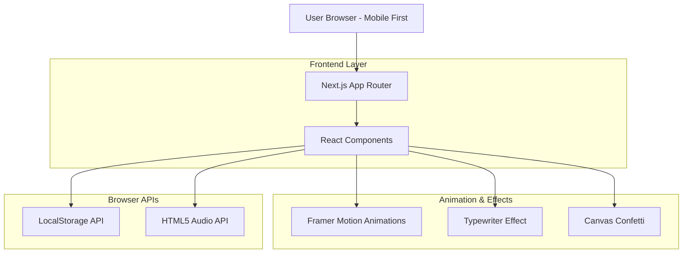

## 1. Architecture Design



## 2. Technology Description

- **Frontend**: Next.js 14 (App Router) + React 18 + TypeScript
- **Styling**: Tailwind CSS 3
- **Animation**: Framer Motion 11
- **Icons**: lucide-react
- **Text Effects**: typewriter-effect
- **Particle Effects**: canvas-confetti
- **Initialization Tool**: create-next-app
- **Backend**: None (Static Site Generation)

## 3. Route Definitions

| Route | Purpose |
|-------|---------|
| / | Main Valentine's Day page with all sections |
| /layout.tsx | Root layout with global styles and metadata |
| /page.tsx | Main page component containing all sections |

## 4. Component Architecture

### 4.1 Core Components Structure
```
src/
├── app/
│   ├── layout.tsx          # Root layout with global styles
│   ├── page.tsx            # Main page orchestrator
│   └── globals.css         # Tailwind CSS and custom styles
├── components/
│   ├── IntroOverlay.tsx    # Heart overlay with entry animation
│   ├── LoveLetter.tsx      # Typewriter effect letter
│   ├── RelationshipTimer.tsx # Live counter component
│   ├── RedPacketCard.tsx   # Individual flip card
│   ├── RedPacketsGrid.tsx  # Container for 3 cards
│   └── ConfettiEffect.tsx  # Canvas confetti wrapper
└── hooks/
    ├── useAudio.tsx        # Audio playback management
    ├── useLocalStorage.tsx # Persistent state management
    └── useIntersectionObserver.tsx # Scroll animations
```

### 4.2 Component Dependencies
- **Framer Motion**: All entrance animations, scroll-triggered animations, card flip effects
- **Typewriter Effect**: Love letter text animation
- **Canvas Confetti**: Prize reveal celebrations
- **Lucide React**: Heart icons and decorative elements

## 5. State Management

### 5.1 Local State (React useState)
- Audio playback state
- Card flip states for each red packet
- Timer tick updates
- Animation completion flags

### 5.2 Persistent State (localStorage)
```typescript
interface RedPacketState {
  card1Flipped: boolean;
  card2Flipped: boolean;
  card3Flipped: boolean;
  lastVisitDate: string;
}
```

### 5.3 Browser APIs Integration
- **HTML5 Audio API**: Background music playback with user interaction requirement
- **Intersection Observer**: Trigger animations on scroll
- **localStorage**: Persist card flip states across sessions
- **Canvas API**: Confetti particle effects

## 6. Animation Specifications

### 6.1 Framer Motion Configurations
```typescript
// Heart pulse animation
const pulseVariants = {
  initial: { scale: 1 },
  animate: {
    scale: [1, 1.2, 1],
    transition: {
      duration: 2,
      repeat: Infinity,
      ease: "easeInOut"
    }
  }
};

// Card flip animation
const flipVariants = {
  initial: { rotateY: 0 },
  flipped: { 
    rotateY: 180,
    transition: { duration: 0.6, type: "spring" }
  }
};
```

### 6.2 Performance Optimizations
- Use `transform` and `opacity` for animations (GPU-accelerated)
- Implement `will-change` CSS property for animated elements
- Lazy load audio files after user interaction
- Debounce scroll events for timer updates

## 7. Mobile-First Responsive Design

### 7.1 Breakpoint Strategy
```css
/* Mobile First Approach */
/* Base styles for mobile devices (320px+) */
/* Tablet adjustments (768px+) */
@media (min-width: 768px) { /* Tablet styles */ }
/* Desktop adjustments (1024px+) */
@media (min-width: 1024px) { /* Desktop styles */ }
```

### 7.2 Touch Interaction Optimizations
- Minimum 44px tap targets for all interactive elements
- Smooth scroll behavior with CSS scroll-behavior
- Touch-friendly card flip animations with proper touch event handling

## 8. Build and Deployment

### 8.1 Build Configuration
```json
{
  "scripts": {
    "dev": "next dev",
    "build": "next build",
    "start": "next start",
    "export": "next build && next export"
  }
}
```

### 8.2 Static Export Optimization
- Use `next export` for static site generation
- Optimize images with Next.js Image component
- Minimize JavaScript bundle size with tree shaking
- Enable compression for static assets

### 8.3 Performance Metrics Targets
- First Contentful Paint: < 1.5s
- Largest Contentful Paint: < 2.5s
- First Input Delay: < 100ms
- Cumulative Layout Shift: < 0.1